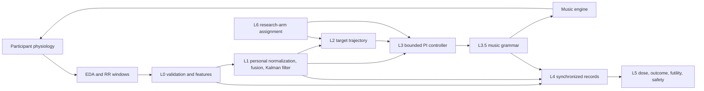

# MDT Closed-Loop Control

The v2.2 research revision centers on **execution contracts** while retaining the physiological closed loop and hierarchical compact agents. The opt-in controller now checks absolute targets, dual TTLs, matching ACKs and finite HOLD/STOP. New evidence tools distinguish natural records, external sources and constructed tests. [Start with the implementation and research index](docs/research/README.md).

[简体中文](README.zh-CN.md) · [Usage](docs/USAGE.md) · [Architecture](docs/ARCHITECTURE.md) · [Validation](docs/VALIDATION.md)

An event-driven research prototype for closed-loop music digital therapeutics (MDT). The system converts EDA and RR-interval windows into a personalized arousal estimate, compares that estimate with a planned therapeutic trajectory, and translates a bounded PI-control command into musically constrained parameter changes.

> [!IMPORTANT]
> This repository is research software. It is **not** a medical device, does not provide medical advice, and must not be used for unsupervised patient care. The included validation uses synthetic signals only and provides no evidence of clinical efficacy.

## What is implemented

- Multi-rate sensing: a 2-second EDA update path and a 15-second EDA/HRV update path.
- Signal validation, missing-value handling, RR-range filtering, EDA decomposition, and time/frequency HRV features.
- Per-person baseline normalization, weighted multimodal fusion, one-dimensional Kalman smoothing, and posterior uncertainty output.
- A response-adaptive ISO trajectory for `FULL_LOOP`, with the fixed open-loop ISO trajectory preserved as a research comparator.
- Uncertainty-derated PI control with a deadband, integral leak, anti-windup, and output clamping.
- A music-grammar safety layer with tempo limits, rate limits, reversible stem layers, and explicit bar/phrase-boundary commits.
- Session lifecycle, monotonic event clocks, calibration isolation, atomic JSON records, dose tracking, ISI outcomes, futility rules, and safety escalation hooks.
- Four research arms: `FULL_LOOP`, `SHAM`, `DIRECT`, and `ISO`.
- Deterministic, isolated synthetic tests and a runnable synthetic demonstration.

## Closed-loop overview

The research architecture is shown below. See the [execution-profile guide](docs/V21_IMPLEMENTATION.md), [v2.2 model dossier](docs/research/MODEL_V22.zh-CN.md), and [editable English diagram](docs/figures/execution-contracts-v22.mmd). The synchronous simulation implementation and the target architecture have explicit limits; a diagram is not evidence that real-device or full experiment integration is complete.


The baseline flow remains active when learning is disabled:



The default legacy controller is (the opt-in normalized formulation is documented separately):

```text
e(k) = target_arousal(k) - estimated_arousal(k)
q(k) = confidence(k) * uncertainty_scale(P(k))
I(k) = clamp(I(k-1) + q(k) * e(k) * dt)
u(k) = clamp(q(k) * (Kp * e(k) + Ki * I(k)))
```

`q(k)` combines feature coverage/signal quality with Kalman posterior variance. Control is continuously derated as reliability falls; live feedback is stopped when confidence is insufficient or posterior uncertainty crosses the hard limit. The adaptive ISO reference advances faster when tracking is good, slows when the participant lags, and freezes on unreliable state estimates. The music grammar then maps `u(k)` to bounded musical parameters and waits for an explicit audio-clock event before applying a change.

## Quick start

Requirements: Python 3.10 or newer.

```bash
git clone https://github.com/YazhouZhu19/mdt-closed-loop.git
cd mdt-closed-loop
python -m venv .venv
source .venv/bin/activate
python -m pip install --upgrade pip
python -m pip install -e .
python demo.py
```

Exercise the execution and evidence workflows:

```bash
python examples/v21_contract_demo.py
python examples/v22_operator_ope_sanity.py
python -m mdt_core.evidence_cli examples/v22_audit_manifest.json
```

Enable the execution profile explicitly in a `FULL_LOOP` simulation:

```python
from mdt_core.config import DEFAULT
from mdt_core.profiles import v21_config

cfg = v21_config(DEFAULT)
```

The profile name records the v2.1 control semantics retained by the v2.2 research revision. It does not load or enable trained models. Supply original `RawWindow.observed_end_t` values and independent `Session.watchdog(t)` ticks; see the profile guide before integration. Default legacy behavior and the four original research arms remain available.

Run the test suite (see [recorded validation and known platform limits](docs/VALIDATION.md)):


```bash
python -m unittest discover -s tests -v
```

Install development tools and run local checks:

```bash
python -m pip install -e ".[dev]"
ruff check mdt_core tests examples demo.py
mypy --no-site-packages --ignore-missing-imports mdt_core tests examples demo.py
python -W error -m unittest discover -s tests -v
```

## Synthetic-data isolation

`demo.py` and `tests/synthetic.py` generate mathematical signals with fixed random seeds. They do not read, contain, or infer patient data. Test and demonstration records are written only to `tempfile.TemporaryDirectory` and are deleted automatically. Synthetic outcomes must not be interpreted as clinical or real-time performance evidence.

## Repository layout

```text
mdt_core/
  config.py       Tunable and validated configuration
  profiles.py     Opt-in execution-contract profile
  execution.py    Epoch / target / TTL / boundary / ACK / STOP gateway
  evidence_protocol.py  Provenance, tri-state audits and M0 occurrence gate
  evidence_cli.py  Strict JSON audit command
  research_metrics.py  Time-aware control and execution metrics
  l0_signal.py    Signal quality, cleaning, EDA and HRV features
  l1_state.py     Personal baseline and arousal-state estimation
  l2_planner.py   Therapeutic target trajectory and dose bands
  l3_control.py   PI controller and music-grammar constraints
  agents/         Offline-fitted emission, trajectory, gain and taste models
  policy.py       Policy contract and bounded inference
  arbiter.py      Deterministic arbitration and explicit hysteresis
  learning.py     Session-local learning orchestration
  l35_mapping.py Rule mapping and preference integration
  l35_guard.py   Frozen music-parameter projection and boundary commits
  trial.py       Trial-period version registry
  l4_l6.py        Recording, outcomes, safety, and research arms
  engine.py       Music-engine interface, null engine, SHAM engine
  session.py      Multi-rate orchestration and lifecycle
  types.py        Cross-layer data types
examples/         Constructed execution, audit and mathematical checks
tests/            Isolated deterministic synthetic tests
docs/             Usage, architecture, validation, and release guidance
demo.py           End-to-end synthetic demonstration
```

## Documentation

- [v2.2 research index, PDFs and evidence status](docs/research/README.md)
- [Execution contract profile and integration limits](docs/V21_IMPLEMENTATION.md)
- [JSON audit command](docs/V22_AUDIT_CLI.md)
- [Evidence protocol and statistical assumptions](docs/V22_EVIDENCE_PROTOCOL.md)

- [Technical report and comparison](docs/TECHNICAL_REPORT.md)
- [Chinese technical report](docs/TECHNICAL_REPORT.zh-CN.md)
- [Detailed usage and integration guide](docs/USAGE.md)
- [System architecture and core algorithms](docs/ARCHITECTURE.md)
- [Learning model and architecture figure (Chinese)](docs/LEARNING_MODEL.zh-CN.md)
- [Learning module configuration, training and usage (Chinese)](docs/LEARNING_MODULES.zh-CN.md)
- [Validation scope and reproducibility](docs/VALIDATION.md)
- [Contributing guide](CONTRIBUTING.md)
- [Code of conduct](CODE_OF_CONDUCT.md)
- [Security policy](SECURITY.md)
- [Release checklist](docs/RELEASE_CHECKLIST.md)

## Current limitations

- `MubertEngine` is an adapter skeleton. Only `NullEngine` and `ShamEngine` are executable in this repository.
- No sensor driver, audio device, WebRTC path, or vendor end-to-end latency has been tested.
- Signal-processing methods and controller parameters have not been validated against clinical datasets.
- Adaptive-trajectory and uncertainty thresholds have synthetic software tests only and are not clinical parameters.
- The JSON recorder is not encrypted and includes a user identifier; it is unsuitable for production health data.
- Hard real-time scheduling, watchdogs, reconnection, cybersecurity controls, risk management, and medical-device verification are outside the current implementation.
- `SafetyMonitor.escalate_hook` must be connected to a staffed human-review workflow before any supervised study use.

The project is therefore suitable for algorithm review, offline simulation, and integration prototyping—not clinical deployment.

## License

Licensed under the [Apache License 2.0](LICENSE). The license permits use,
modification, and redistribution subject to its terms and includes an explicit
patent license. It does not imply medical-device approval, clinical efficacy,
or fitness for patient care; the research and safety limitations above remain
applicable.

## v2.2 evidence protocol

The publication route now centers on execution contracts; hierarchy effects remain exploratory. See [the evidence protocol](docs/V22_EVIDENCE_PROTOCOL.md) for tri-state adjudication, F1/F2/F3 provenance, and the M0 audit gate. The [local inventory](docs/validation/v22_m0_inventory.json) contains no eligible natural execution logs: real-world rates are unassessed. [The operator-OPE check](examples/v22_operator_ope_sanity.py) reproduces known mathematical identities and a clipping support counterexample, not a new method or efficacy result. These research helpers do not change the v2.1 runtime.
