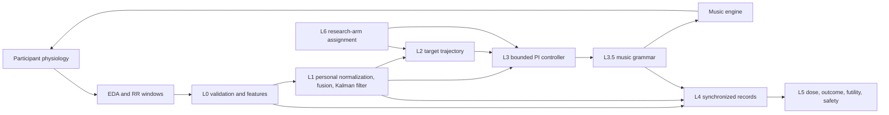

# MDT Closed-Loop Control

[简体中文](README.zh-CN.md) · [Usage](docs/USAGE.md) · [Architecture](docs/ARCHITECTURE.md) · [Validation](docs/VALIDATION.md)

An event-driven research prototype for closed-loop music digital therapeutics (MDT). The system converts EDA and RR-interval windows into a personalized arousal estimate, compares that estimate with a planned therapeutic trajectory, and translates a bounded PI-control command into musically constrained parameter changes.

> [!IMPORTANT]
> This repository is research software. It is **not** a medical device, does not provide medical advice, and must not be used for unsupervised patient care. The included validation uses synthetic signals only and provides no evidence of clinical efficacy.

## What is implemented

- Multi-rate sensing: a 2-second EDA update path and a 15-second EDA/HRV update path.
- Signal validation, missing-value handling, RR-range filtering, EDA decomposition, and time/frequency HRV features.
- Per-person baseline normalization, weighted multimodal fusion, one-dimensional Kalman smoothing, and posterior uncertainty output.
- A response-adaptive ISO trajectory for `FULL_LOOP`, with the fixed open-loop ISO trajectory preserved as a research comparator.
- Uncertainty-derated PI control with a deadband, integral leak, anti-windup, and output clamping.
- A music-grammar safety layer with tempo limits, rate limits, reversible stem layers, and explicit bar/phrase-boundary commits.
- Session lifecycle, monotonic event clocks, calibration isolation, atomic JSON records, dose tracking, ISI outcomes, futility rules, and safety escalation hooks.
- Four research arms: `FULL_LOOP`, `SHAM`, `DIRECT`, and `ISO`.
- Deterministic, isolated synthetic tests and a runnable synthetic demonstration.

## Closed-loop overview



The controller is:

```text
e(k) = target_arousal(k) - estimated_arousal(k)
q(k) = confidence(k) * uncertainty_scale(P(k))
I(k) = clamp(I(k-1) + q(k) * e(k) * dt)
u(k) = clamp(q(k) * (Kp * e(k) + Ki * I(k)))
```

`q(k)` combines feature coverage/signal quality with Kalman posterior variance. Control is continuously derated as reliability falls; live feedback is stopped when confidence is insufficient or posterior uncertainty crosses the hard limit. The adaptive ISO reference advances faster when tracking is good, slows when the participant lags, and freezes on unreliable state estimates. The music grammar then maps `u(k)` to bounded musical parameters and waits for an explicit audio-clock event before applying a change.

## Quick start

Requirements: Python 3.10 or newer.

```bash
git clone <your-repository-url>
cd mdt-closed-loop
python -m venv .venv
source .venv/bin/activate
python -m pip install --upgrade pip
python -m pip install -e .
python demo.py
```

Run the test suite:

```bash
python -m unittest discover -s tests -v
```

Install development tools and run local checks:

```bash
python -m pip install -e ".[dev]"
ruff check mdt_core tests demo.py
mypy --no-site-packages --ignore-missing-imports mdt_core tests demo.py
python -W error -m unittest discover -s tests -v
```

## Synthetic-data isolation

`demo.py` and `tests/synthetic.py` generate mathematical signals with fixed random seeds. They do not read, contain, or infer patient data. Test and demonstration records are written only to `tempfile.TemporaryDirectory` and are deleted automatically. Synthetic outcomes must not be interpreted as clinical or real-time performance evidence.

## Repository layout

```text
mdt_core/
  config.py       Tunable and validated configuration
  l0_signal.py    Signal quality, cleaning, EDA and HRV features
  l1_state.py     Personal baseline and arousal-state estimation
  l2_planner.py   Therapeutic target trajectory and dose bands
  l3_control.py   PI controller and music-grammar constraints
  l4_l6.py        Recording, outcomes, safety, and research arms
  engine.py       Music-engine interface, null engine, SHAM engine
  session.py      Multi-rate orchestration and lifecycle
  types.py        Cross-layer data types
tests/            Isolated deterministic synthetic tests
docs/             Usage, architecture, validation, and release guidance
demo.py           End-to-end synthetic demonstration
```

## Documentation

- [Detailed usage and integration guide](docs/USAGE.md)
- [System architecture and core algorithms](docs/ARCHITECTURE.md)
- [Validation scope and reproducibility](docs/VALIDATION.md)
- [Contributing guide](CONTRIBUTING.md)
- [Code of conduct](CODE_OF_CONDUCT.md)
- [Security policy](SECURITY.md)
- [Release checklist](docs/RELEASE_CHECKLIST.md)

## Current limitations

- `MubertEngine` is an adapter skeleton. Only `NullEngine` and `ShamEngine` are executable in this repository.
- No sensor driver, audio device, WebRTC path, or vendor end-to-end latency has been tested.
- Signal-processing methods and controller parameters have not been validated against clinical datasets.
- Adaptive-trajectory and uncertainty thresholds have synthetic software tests only and are not clinical parameters.
- The JSON recorder is not encrypted and includes a user identifier; it is unsuitable for production health data.
- Hard real-time scheduling, watchdogs, reconnection, cybersecurity controls, risk management, and medical-device verification are outside the current implementation.
- `SafetyMonitor.escalate_hook` must be connected to a staffed human-review workflow before any supervised study use.

The project is therefore suitable for algorithm review, offline simulation, and integration prototyping—not clinical deployment.

## License

No open-source license has been selected yet. Before publishing the repository, choose and add a `LICENSE` file. Apache-2.0 is often appropriate when an explicit patent grant is desired; MIT is shorter and more permissive. See the [release checklist](docs/RELEASE_CHECKLIST.md).
