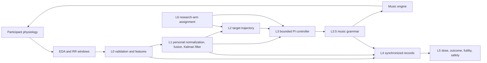

# MDT 闭环控制系统

[English](README.md) · [详细使用说明](docs/USAGE.zh-CN.md) · [系统架构](docs/ARCHITECTURE.md) · [验证报告](docs/VALIDATION.md)

这是一个复合音乐数字疗法（MDT）闭环控制研究原型。系统把 EDA 和 RR 间期窗口转化为个体化唤醒度估计，将估计状态与治疗目标轨迹比较，再通过带约束的 PI 控制器和音乐语法层生成可播放的音乐参数。

> [!IMPORTANT]
> 本项目是研究软件，**不是医疗器械**，不提供医疗建议，也不能用于无人监督的患者治疗。当前验证全部基于合成信号，不构成临床有效性证据。

v2.2 将**执行契约**作为研究主线，保留生理闭环与层级小型 Agent。显式启用的新执行配置提供绝对目标、双 TTL、ACK 与有限 HOLD/STOP；新增证据工具区分自然日志、外部来源和构造场景。完整说明、两份 PDF 与证据状态见 [v2.2 研究入口](docs/research/README.md)。

## 已实现功能

- 多速率输入：2 秒 EDA 快速通路和 15 秒 EDA/HRV 慢速通路。
- 信号输入校验、缺失插值、RR 生理范围过滤、EDA 分解及时域/频域 HRV 特征。
- 个体基线标准化、加权多模态融合、一维 Kalman 平滑及后验不确定性输出。
- FULL_LOOP 使用响应驱动的自适应 ISO 轨迹；开环 ISO 研究臂保留固定轨迹作为对照。
- 带不确定性降额、死区、积分泄漏、抗积分饱和和输出限幅的 PI 控制器。
- 音乐语法安全层：速度范围、变化率限制、可逆配器层级和明确的小节/乐句边界提交。
- 会话状态机、单调事件时钟、校准隔离、原子化 JSON 记录、剂量管理、ISI 结局、无效停治和安全升级接口。
- `FULL_LOOP`、`SHAM`、`DIRECT`、`ISO` 四种研究分臂。
- 确定性、隔离的合成测试及端到端合成演示。
- 默认关闭的学习模块：校准发射模型、轨迹老虎机、3-A 增益调度、偏好映射，配套确定性仲裁、冻结守卫和版本审计。见[学习型模块改造与使用](docs/LEARNING_MODULES.zh-CN.md)。

## 闭环过程

研究架构如下。执行行为与限制见[配置指南](docs/V21_IMPLEMENTATION.md)，完整模型见[v2.2 研究详述](docs/research/MODEL_V22.zh-CN.md)，另附[可编辑英文结构图](docs/figures/execution-contracts-v22.mmd)。图中的目标规范与当前同步仿真实现分别说明，不能将结构图视为真实设备或完整实验已完成的证明。


学习开关关闭时保留以下基线流程：



默认 legacy 路径的控制律如下；显式启用的 normalized 变体另见执行配置指南：

```text
e(k) = target_arousal(k) - estimated_arousal(k)
q(k) = confidence(k) * uncertainty_scale(P(k))
I(k) = clamp(I(k-1) + q(k) * e(k) * dt)
u(k) = clamp(q(k) * (Kp * e(k) + Ki * I(k)))
```

`q(k)` 同时考虑特征覆盖/信号质量和 Kalman 后验方差。可靠度下降时控制连续降额；超过硬不确定性阈值或置信度不足时停止实时反馈、泄放积分并取消尚未播放的命令。FULL_LOOP 的 ISO 轨迹在患者跟踪良好时加快，在明显滞后时减慢，在状态不可靠时冻结。`MusicGrammar` 再把控制量映射为速度、配器层级和派生音乐参数，并等待音频引擎明确报告的小节或乐句边界后提交。

## 快速开始

要求 Python 3.10 或更高版本。

```bash
git clone https://github.com/YazhouZhu19/mdt-closed-loop.git
cd mdt-closed-loop
python -m venv .venv
source .venv/bin/activate
python -m pip install --upgrade pip
python -m pip install -e .
python demo.py
```

运行本次实现的执行与证据流程：

```bash
python examples/v21_contract_demo.py
python examples/v22_operator_ope_sanity.py
python -m mdt_core.evidence_cli examples/v22_audit_manifest.json
```

在 `FULL_LOOP` 仿真中通过 `cfg = v21_config(DEFAULT)` 显式启用执行契约。名称沿用 v2.1 控制语义；v2.2 重构研究证据路线。该配置不自动加载学习模型。适配器须提供原始 `observed_end_t`，并独立调用 `Session.watchdog(t)`；示例使用 NullEngine，不产生真实音频。

运行测试（完整记录与平台限制见[验证说明](docs/VALIDATION.md)）：

```bash
python -m unittest discover -s tests -v
```

执行完整开发检查：

```bash
python -m pip install -e ".[dev]"
ruff check mdt_core tests examples demo.py
mypy --no-site-packages --ignore-missing-imports mdt_core tests examples demo.py
python -W error -m unittest discover -s tests -v
```

## 合成数据隔离

`demo.py` 和 `tests/synthetic.py` 使用固定随机种子生成数学信号，不读取、不包含、也不推断真实患者数据。测试和演示记录只写入 `tempfile.TemporaryDirectory`，结束后自动删除。合成结果不能解释为疗效或真实实时性能证据。

## 代码结构

| 位置 | 职责 |
|---|---|
| `mdt_core/config.py` | 可整定且经过校验的配置 |
| `mdt_core/l0_signal.py` | 信号质量、清洗、EDA 与 HRV 特征 |
| `mdt_core/l1_state.py` | 个体基线与唤醒度状态估计 |
| `mdt_core/l2_planner.py` | 治疗目标轨迹与剂量区间 |
| `mdt_core/l3_control.py` | PI 控制器与音乐语法约束 |
| `mdt_core/policy.py`、`arbiter.py` | 策略协议、限时推理、确定性仲裁 |
| `mdt_core/agents/` | 离线拟合、校准、版本化的学习模型 |
| `mdt_core/l35_mapping.py`、`l35_guard.py` | 可学映射与冻结安全守卫 |
| `mdt_core/learning.py`、`trial.py` | 学习编排、试验期版本固定与审计 |
| `mdt_core/l4_l6.py` | 记录、结局、安全与研究分臂 |
| `mdt_core/engine.py` | 音乐引擎接口、离线引擎、SHAM 引擎 |
| `mdt_core/session.py` | 多速率编排与会话生命周期 |
| `tests/` | 隔离的确定性合成测试 |

## 详细文档

- [中文技术报告：项目特点及同类方案比较](docs/TECHNICAL_REPORT.zh-CN.md)
- [英文技术报告](docs/TECHNICAL_REPORT.md)
- [中文使用与集成说明](docs/USAGE.zh-CN.md)
- [英文使用与集成说明](docs/USAGE.md)
- [系统架构与核心算法](docs/ARCHITECTURE.md)
- [学习型模型描述与论文风格结构图](docs/LEARNING_MODEL.zh-CN.md)
- [学习型模块配置、训练与使用](docs/LEARNING_MODULES.zh-CN.md)
- [验证范围与复现方法](docs/VALIDATION.md)
- [贡献指南](CONTRIBUTING.md)
- [行为准则](CODE_OF_CONDUCT.md)
- [安全政策](SECURITY.md)
- [GitHub 发布清单](docs/RELEASE_CHECKLIST.md)

## 当前边界

- 学习模块默认关闭，没有内置临床训练数据或有效性验证过的策略权重。

- `MubertEngine` 仍是适配骨架；仓库内实际可执行的是 `NullEngine` 和 `ShamEngine`。
- 尚未验证真实传感器、声卡、WebRTC 或供应商链路的端到端时延。
- 信号算法和控制参数尚未用临床数据完成对照验证与整定。
- 自适应轨迹阈值和不确定性阈值目前仅完成合成软件测试，尚未形成临床参数。
- JSON 记录未加密且包含用户标识，不能用于生产健康数据。
- 尚无硬实时调度、看门狗、断线重连、网络安全、风险管理和医疗器械软件验证材料。
- `SafetyMonitor.escalate_hook` 在任何监督性研究使用前都必须连接到真实、有人值守的人工复核流程。

因此，当前版本适合算法审查、离线仿真和系统集成原型，不适合临床部署。

## 许可证

本项目采用 [Apache License 2.0](LICENSE)。在遵守许可证条款的前提下，
允许使用、修改和再分发，并包含明确的专利授权。开源许可不代表医疗器械批准、
临床疗效或适用于患者诊疗；上述研究与安全限制仍然适用。

## v2.2 证据协议与研究路线

论文主线调整为执行契约，层级收益仅作探索。新增[证据协议](docs/V22_EVIDENCE_PROTOCOL.md)，区分三态审计、F1/F2/F3 来源和 M0 判断门。[本地盘点](docs/validation/v22_m0_inventory.json)尚未发现合格自然执行日志，真实发生率保持未测。[执行算子 OPE 检查](examples/v22_operator_ope_sanity.py)复现已知恒等式与裁剪支持反例，不是新方法或效果结果。这些研究工具不改变 v2.1 运行控制逻辑。
