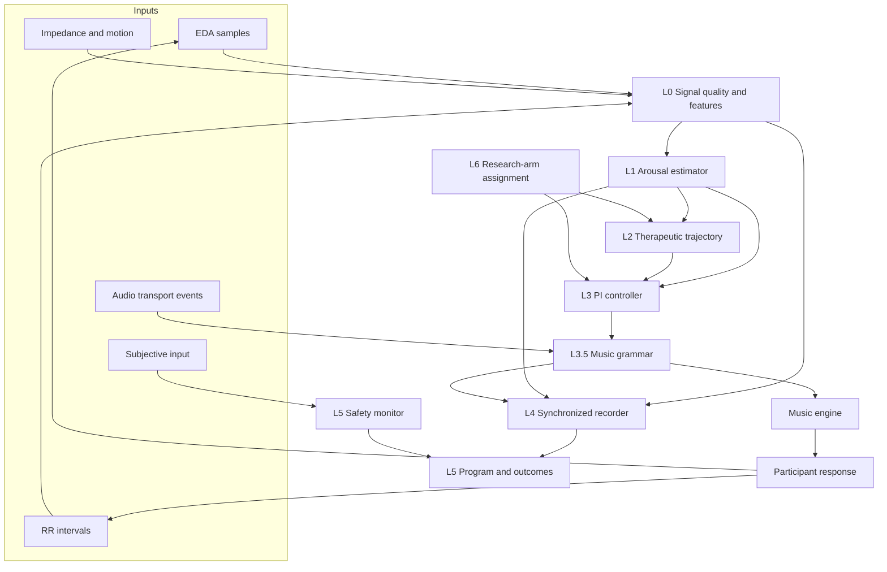
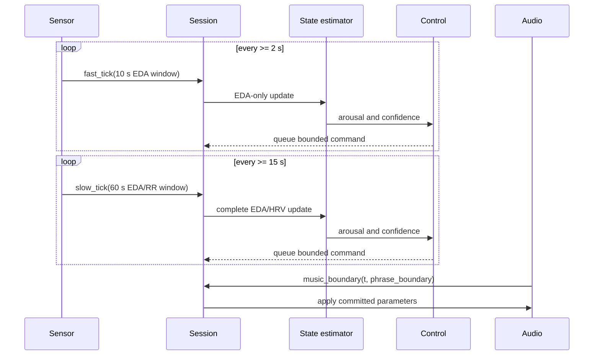
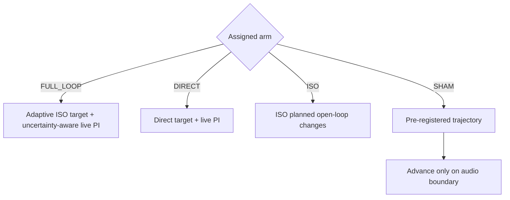
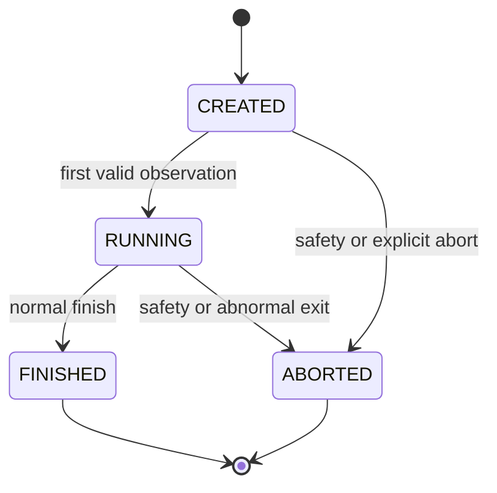

# Architecture and Core Algorithms

## 1. Scope

The implementation is a soft-real-time, event-driven research prototype. It accepts timestamped sensor windows and audio transport events, but it does not own an operating-system scheduler, device driver, audio renderer, or deadline monitor. Consequently, it cannot claim deterministic hard-real-time behavior.

## 2. Layered model



All cross-layer values use dataclasses and enums from `mdt_core/types.py`.

## 3. L0: signal validation and features

### EDA

1. Verify finite, non-negative session time and positive sampling rate.
2. Measure the missing fraction.
3. Interpolate a small number of missing samples; discard EDA when loss exceeds the configured threshold.
4. Apply a Butterworth low-pass filter.
5. Estimate tonic activity with a slower low-pass filter and derive the phasic component.
6. Calculate tonic slope and suprathreshold skin-conductance-response rate.

### HRV

1. Keep only finite RR intervals within the configured physiological range.
2. Remove intervals that differ from the median by more than the ectopic threshold.
3. Calculate RMSSD and SD1.
4. Interpolate the tachogram to 4 Hz, estimate a Welch spectrum, and integrate power from 0.15 to 0.40 Hz.

Quality is classified as `OK`, `NOISY`, or `LOST`. A lost EDA channel does not automatically remove usable HRV in the slow path.

## 4. L1: personalized arousal estimation

The first valid calibration sessions produce a per-feature personal mean and standard deviation. A baseline is ready only when all required EDA and HRV features are present and finite.

For feature `j`:

```text
z_j = (x_j - mu_j) / sigma_j
```

Parasympathetic HRV features (`RMSSD`, `HF power`, and `SD1`) are sign-inverted so that a positive normalized value consistently means higher inferred arousal.

Available EDA Z scores and HRV Z scores are averaged within modality and fused with configured weights:

```text
z_fused = weighted_mean(z_EDA, z_HRV)
measurement = logistic(clamp(z_fused) / 1.25)
```

The one-dimensional Kalman update is:

```text
P_pred = P_prev + Q * process_scale
K      = P_pred / (P_pred + R_quality)
x_new  = x_prev + K * (measurement - x_prev)
P_new  = (1 - K) * P_pred
```

`process_scale` is derived from the actual update interval relative to the configured slow-step reference. Prediction runs even when a measurement is missing, so posterior variance grows rather than preserving stale certainty. Noisy input doubles measurement variance. Confidence combines feature coverage with the quality class; posterior variance is emitted separately as `State.uncertainty`.

The estimator outputs arousal only. EDA and HRV do not reliably determine emotional valence; valence must come from a validated subjective instrument.

## 5. L2: therapeutic trajectory

### ISO strategy

The initial reliable state becomes the anchor. The default trajectory:

- matches the anchor for 300 seconds;
- descends linearly for 900 seconds;
- remains at the configured floor for the rest of the session.

`FULL_LOOP` uses a stateful adaptive form. After the matching phase, reference
progress is multiplied by a speed factor derived from tracking lag and the same
state reliability used by the controller. On-track response can accelerate the
descent, lagging response slows it, and an unreliable estimate freezes progress.
The target is monotonic: an anchor already below the sleep-oriented floor is
held rather than raised.

The `ISO` open-loop research arm intentionally retains the fixed wall-clock
trajectory so the adaptive live policy is not leaked into its comparator.

### DIRECT strategy

The target remains at the configured direct value throughout the session.

Both trajectories return a normalized arousal target in `[0, 1]`.

## 6. L3: bounded PI controller

```text
e(k) = a_target(k) - a_estimated(k)
q(k) = confidence(k) * uncertainty_scale(P(k))

if q(k) == 0:
    I(k) = leak * I(k-1)
    u(k) = 0
elif |e(k)| < deadband:
    I(k) = leak * I(k-1)
    u(k) = 0
else:
    I(k) = clamp(I(k-1) + q(k) * e(k) * dt, -I_max, I_max)
    u(k) = clamp(q(k) * (Kp * e(k) + Ki * I(k)), -u_max, u_max)
```

The uncertainty scale is one below the soft posterior-variance threshold, decreases linearly to zero, and remains zero above the hard threshold. This both reduces proportional actuation and prevents integral wind-up while the system is derated. There is no derivative term because physiological measurements are noisy and an unfiltered derivative would amplify high-frequency artifacts. A low-confidence or high-uncertainty state bypasses PI control and cancels pending actuation.

## 7. L3.5: music grammar

The music grammar is a mandatory constraint layer between control and playback.

- Positive control raises arousal-oriented parameters; negative control lowers them.
- Tempo is restricted to the configured range and maximum change per 30 seconds.
- Structural changes move by a bounded number of reversible layer levels.
- Continuous changes commit on a bar or phrase event.
- Layer changes commit only on a phrase event.
- Zero, stale, or unsafe commands cancel pending changes.

Derived dynamics, brightness, rhythmic accent, and reverb remain consistent with the normalized tempo position.

## 8. Multi-rate orchestration



Sensor and music events share monotonic session time. Processing an older event after a newer event is rejected before actuation.

## 9. Research arms



Assignment uses a salted SHA-256 mapping for reproducibility. A production trial should use a study-specific secret salt, persist assignments in the trial system, and validate allocation concealment independently.

## 10. Session lifecycle



- `finish` is idempotent after persistence.
- An empty treatment session cannot be marked complete.
- Invalid outcome input is rejected before ordinary completion side effects.
- Safety content is evaluated before ordinary form validation so malformed forms cannot suppress escalation.
- A safety-aborted session is not added to completed treatment dose.

## 11. Data recording

Physiology/state, music/control, and subjective tracks use the same session-time domain. JSON persistence uses a temporary sibling file followed by an atomic replace.

Physiology rows include observation confidence and posterior uncertainty. Music
rows include control output, reliability scale, trajectory phase, and adaptive
speed so a study can reconstruct why each command was produced.

This mechanism protects file completeness only. Production health-data storage also requires pseudonymization, encryption in transit and at rest, access control, audit logs, retention/deletion policy, consent records, and jurisdiction-specific privacy review.

## 12. Production gap

The core algorithm is implemented and testable offline. A deployable clinical system still requires:

- validated sensor drivers and window synchronization;
- a functioning low-latency music engine;
- measured latency and jitter budgets;
- watchdogs, reconnection, fault containment, and safe defaults;
- independently validated signal and control parameters;
- human-factors testing and a staffed safety workflow;
- secure regulated data infrastructure;
- software lifecycle, risk, cybersecurity, and clinical evidence appropriate to the intended regulatory classification.
