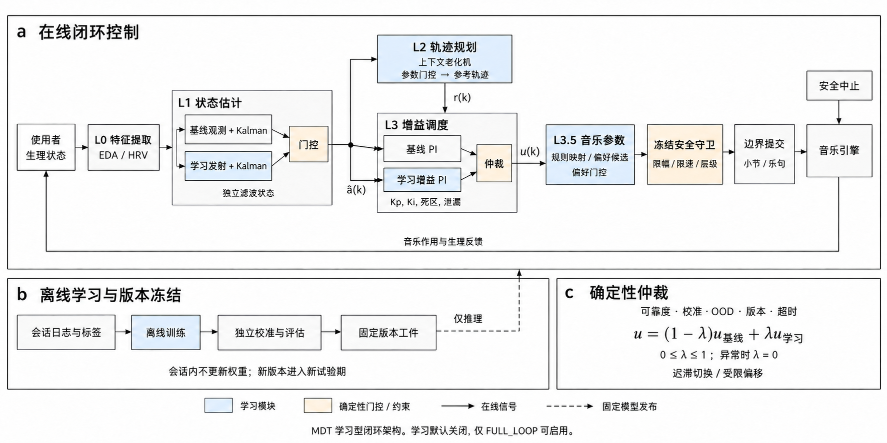
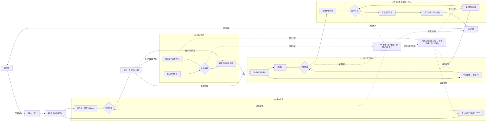

# MDT 学习型闭环控制模型说明

依据当前代码实现整理，日期：2026-09-17。

改造后的 MDT 是一个**以规则控制为基础、由离线学习模块提供个体化建议、经过仲裁与音乐约束后执行的多层闭环系统**。它根据使用者的生理反应调整音乐参数，再观察新的生理反应。学习覆盖“如何估计状态、如何设定目标、如何调整控制增益、如何贴合偏好”四个位置。

## 模型组成与信息流

| 层级 | 输入与处理 | 输出及改造重点 |
|---|---|---|
| **L0 信号层** | EDA、RR 间期及运动/接触质量；清洗、质量分类、特征提取 | SCL 斜率、SCR 频率、RMSSD、HF、SD1。保留确定性处理，支持 EDA 快通路与 EDA/HRV 慢通路。 |
| **L1 状态层** | 个体基线标准化后的特征，经过观测模型与一维 Kalman 滤波 | 唤醒度估计、观测置信度、后验方差。原估计器持续独立运行；学习估计器经仲裁后参与状态混合。 |
| **L2 目标层** | 初始状态、个体基线、历史结局、会话次数与质量摘要 | 分层上下文老虎机建议轨迹参数，经仲裁后交给确定性规划器，生成目标唤醒度轨迹。 |
| **L3 控制层** | 目标与当前状态的偏差、可靠度 | 原 PI 与学习增益 PI 分别计算控制量，仲裁后产生最终控制量。实现附件的 **3-A 增益调度路线**。 |
| **L3.5 音乐层** | 控制量、当前音乐参数及偏好上下文 | 规则映射与偏好排序形成候选，经仲裁、冻结守卫及真实音乐边界提交后播放。 |
| **L4—L6 监督层** | 生理、音乐、自评、策略决策与试验配置 | 记录审计、疗程结局与停治规则、安全升级及试验分臂；中止可覆盖学习输出。 |

L1 只估计 **0—1 归一化唤醒度**。正负情绪效价由自评提供，不由 EDA/HRV 推断。

## 四个学习模块

**L1：学习观测关系，保留滤波结构。** 高斯发射模型从特征与时间对齐的主观弱标签学习 $p(\mathbf{x}\mid a)$，为原一维 Kalman 结构提供观测值与方差。基线与学习分支各自维护滤波状态。训练、校准、评估按会话分离；观测区间和时序后验都要求平均覆盖偏差 ECE < 0.05，90% 区间覆盖率在 85%—95%。这里的 ECE 是区间覆盖偏差，非分类 ECE。工件同时绑定个体基线、滤波配置与已验证时间尺度。缺失、噪声、部分特征或不支持的采样历史会使学习分支整场回退，因此当前完整窗口工件不能直接宣称适用于混合快慢通路。

**L2：选择个人化轨迹形状。** 群体上下文奖励回归与个体效应部分池化，数据少的新个体使用群体后验。候选动作包含起点偏移、匹配时长、下降时长、目标下限和速度系数，均有固定边界。模型采用后验均值 softmax 与均匀探索混合的类别采样，记录该采样器的精确动作概率。在首个可锚定状态上至多尝试一次决策；未通过可靠度门控则保留默认参数。之后参数固定，由原响应自适应规划器依据跟踪状态调节下降进度。

**L3：学习增益，保留 PI。** 离线线性模型输出 $K_p$、$K_i$、死区和积分泄漏系数。基线 PI 与增益 PI 分别维护积分，两者接受同一仲裁后状态。积分硬限、输出硬限与可靠度阈值不由模型修改。现阶段未实现 MPC 或端到端强化学习；增益预测校准也不等于闭环稳定性证明。

**L3.5：偏好参与候选，守卫决定可执行范围。** 偏好模型根据已观察的喜欢/跳过等反馈排序音乐参数候选，经校准与仲裁后进入冻结守卫。守卫限制速度范围、变化速率和声部层级，并在真实小节/乐句事件上提交；失联或中止取消待执行变化。当前提供参数/stem 接口，尚无完整曲库服务。

## 闭环控制与仲裁

令 $\hat a_t$ 为仲裁后的唤醒度，$r_t$ 为目标，$C_t$ 为观测置信度，$P_t$ 为后验方差。控制可靠度为：

$$
q_t=C_t\,\operatorname{clip}\!\left(\frac{P_{\mathrm{hard}}-P_t}{P_{\mathrm{hard}}-P_{\mathrm{soft}}},0,1\right),\qquad e_t=r_t-\hat a_t.
$$

可靠度降低时，PI 的误差积分和输出同时减弱；无可靠观测时停止新增调节。L3 两路输出按门控权重混合：

$$
u_t=(1-\lambda_t)u_t^{\mathrm{base}}+\lambda_t u_t^{\mathrm{gain}},\qquad 0\le\lambda_t\le1.
$$

同类仲裁分别应用于 L1 状态、L2 参数、L3 控制量和偏好候选。权重取决于可靠度、已验证策略置信度和权限；默认进入/退出可靠度为 0.50/0.35，具有迟滞。OOD、异常、超时、版本不符、未校准或低置信度大分歧均回退。受限模式进一步限制与基线的差值。L1 混合时使用较大方差并加入两路均值分歧项，避免混合产生虚假确定性。

## 学习周期与实现边界

**离线周期：** 批准的数据与标签 → 按会话分离的拟合、校准、评估 → 固定版本工件。**在线周期：** 加载冻结工件 → 推理建议 → 仲裁 → 音乐守卫 → 执行及记录。会话中不更新模型参数，L2 也不反复探索。新版本进入新的试验期。

学习功能默认全部关闭，仅 `FULL_LOOP` 非校准会话可显式启用。支持影子、建议、受限、自主模式，无自动晋级；对照臂完全绕过模型。试验清单固定版本、开关和权限；审计记录上下文、建议、概率、仲裁、混合及实际音乐输出。记录的建议概率不是混合/投影后实际执行参数的概率，不能直接用于 IPS/DR 疗效估计。

当前是可运行的工程研究原型，未内置真实参与者训练数据或经临床验证的权重。软件检查通过不能证明疗效优于原 PI；仍需目标人群数据校准、设备联调、闭环仿真与预注册研究。生产数据权限、加密及跨设备版本注册表也需部署层提供。

## 可编辑结构图

以下 Mermaid 保留精确的模块连接；实线表示在线闭环，虚线表示离线工件发布或监督关系。“仲裁”节点分别执行各模块门控。

实现对应：[会话编排](../mdt_core/session.py)、[学习运行时](../mdt_core/learning.py)、[仲裁规则](../mdt_core/arbiter.py)。配置、工件训练及详细边界见[学习模块改造与使用](LEARNING_MODULES.zh-CN.md)。

## 图像制作说明

当前结构图使用内置 ImageGen 重绘为论文风格：白底、细线框、低饱和配色，并以 a/b/c 三个面板分别表达在线闭环、离线学习与版本冻结、确定性仲裁。参考 [FALCON 论文图 2](https://www.nature.com/articles/s44182-024-00013-0.pdf) 的分面与连线组织方式，仅借鉴绘图风格，不引入该论文的控制算法。模型方法与模块含义保持不变，以本文及可编辑 Mermaid 为准。

论文风格提示词保留于[重绘提示词](figures/paper-style-prompt.txt)、[校对提示词](figures/paper-style-correction-prompt.txt)和[连线修订提示词](figures/paper-style-connectivity-prompt.txt)。独立图源见 [Mermaid 源文件](figures/learning-architecture.mmd)。
