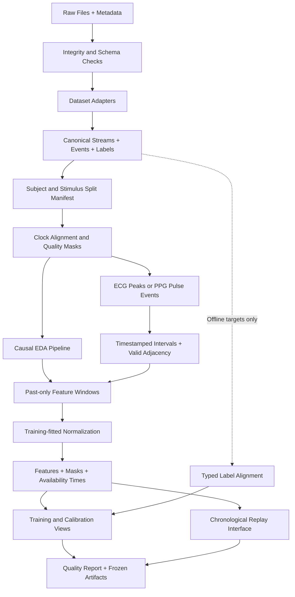

# MDT 数据读取与预处理标准流程

版本：SOP 2.2｜日期：2026-09-19｜范围：公开数据、离线训练、时间顺序回放与仿真输入。

本文定义本项目的研究流程，不是医学测量标准。以下“建议初始参数”必须经过训练/验证集试运行再冻结。本版在 v2.1 的因果预处理、双 TTL、分支和 ACK 规范上新增来源分级、M0 可判定性与执行算子日志要求，未下载或处理全量数据。既有代码已具备整体 RawWindow 来源时刻与仿真执行 profile；逐模态快照和新日志 schema 是建议契约，不表示当前已经自动采集所有字段。实际实现边界以对应代码、测试及修订验收清单为准。

最终输出不是一张失去来源的大 CSV，而是可追溯的信号、心搏、特征、标签和拆分清单。每个特征必须能回答：来自谁、哪段原始信号、什么单位、用了哪些处理、在什么时候才能被控制器读取。



## 0. 先区分信号来源、运行来源与证据用途

沿用研究限制：当前只使用公开数据和仿真，不新增真人采集。E1/E2/E3 继续表示状态估计、睡眠域辅助与反应性仿真实验；层级组织探索记为 E_hier（附件 E1）。研究前提记为 P0（附件 H0），避免与统计学零假设混淆。P0 询问自然运行归因失效是否达到预先规定的不可忽略频率，必须由 M0 的合格自然运行日志审计回答。

信号真实不代表运行自然。CASE/WESAD 的真实波形可以驱动回放或仿真，但由此产生的音乐命令、ACK 和故障属于新软件运行，不能充作真实用户实际听到的执行事实。BCMI 含音乐反馈研究阶段，也必须另行核查动作、设备确认、时间和完整性，不能仅凭研究名称纳入 M0。

当前工作区相关工件盘点只找到合成 demo、NullEngine 模拟 ACK、legacy 回归 fixture、测试结果和文档清单，未发现可纳入 M0 的自然执行日志。因此 M0=NOT_ASSESSABLE、P0=NOT_ASSESSED；发生率与置信区间为空。此状态不表示“无失效”“故障罕见”或“P0 不成立”。在不新增真人采集的约束下，继续公开数据适配与仿真，同时保留这一现实证据缺口。

| 独立维度 | 建议字段与取值 | 不允许的替换 |
| --- | --- | --- |
| 信号来源 | data_origin：recorded / derived / injected / simulated | 真实来源信号不自动使模拟运行变成自然执行 |
| 运行来源 | run_origin：natural_deployment / passive_public_recording / replay / simulation / test | public 或 recorded 不能代替自然运行审查 |
| 故障来源 | fault_provenance：F1 / F2 / F3 / unreviewed | 未审计来源不能推定 F1 或 F2 |
| 动力学族 | dynamics_family：DYN-L / DYN-N / DYN-R | 不再用 F1/F2/F3 命名动力学族 |
| 审查状态 | provenance_review_status、license_status、log_completeness | 未知不填成已通过，缺失不填成正常 |

F1 限于合格 M0 自然事件；F2 限于有具体来源定位且参数条件可核查的外部事件；F3 是构造性压力场景。事件类型有外部出处而强度无出处时，人工扩展部分另列 F3。三类不合并计算平均收益；已有软件测试属于机制证据，不能填入自然发生率分母。

本 SOP 支持论文一的系统机制证据与论文三的候选 OPE 数据契约。论文三的新颖性、最小实验和理论门尚需独立完成，不能因日志字段齐全就宣布新方法成立；论文二的人体效果为未来独立工作。P0/M0 未完成不阻塞已授权的预处理与机制实现，但阻止现实频率/F1 收益主张。

## 1. 固定数据版本，原始文件只读

每个数据集保存 `dataset_id/version/source_url/license/access_date`，对下载文件计算 SHA-256。保留原目录结构、README、通道说明、事件说明和标注说明。确认文件是实际数据而非下载错误页、Git LFS 或 git-annex 指针。

分别记录论文人数、发布清单人数、下载成功人数和质量审查后的可用人数。不同来源的同名 `subject01` 必须加数据集命名空间；BCMI 各阶段同一个人的代码则需要统一映射，防止跨阶段泄漏。

推荐目录：

```text
data/
  raw/<dataset>/<version>/          # Read-only source files
  manifests/                       # Provenance and checksums
  canonical/<dataset>/             # Streams, events, labels, beats
  splits/<split_version>/          # Subject/stimulus membership
  derived/<pipeline_hash>/<fold>/   # Features, masks, labels
  fitted/<pipeline_hash>/<fold>/    # Scalers and calibration
  qc/<pipeline_hash>/<fold>/        # Exclusions and diagnostics
```

原始文件之外的结果不得覆盖源数据。训练工件必须记录原始文件哈希、适配器版本、参数、依赖环境与 Git 版本。

## 2. 使用数据集适配器，不在读取阶段混合数据

读取器负责解析格式、解释元数据、转换有依据的单位及生成明确 ID。滤波、归一化、窗口和训练由后续公共管线处理。未知字段、单位、采样率或时间轴应使该会话停留在待审查状态，不能猜测后继续。

| 数据集 | 推荐读取对象 | 必须保留或核查 |
| --- | --- | --- |
| CASE | 官方 raw 或 non-interpolated 数据及 metadata/scripts | raw 没有视频 ID；按官方元数据重建刺激事件。已有插值版须先审查插值是否适合当前时序协议。[1] |
| WESAD | 官方发布包内的生理数组、标签及问卷；常用 PKL 版须核对实际键与说明 | 胸/腕不同原生采样率；不能按相同行号直接拼接。只读取可信的官方序列化文件。[2] |
| DREAMT | 固定 2.2.0 的 CSV/元数据/睡眠标签 | 区分存储网格与传感器原生频率、E4 IBI 与 PSG ECG、有效 PSG 时段及准备时段。[3] |
| BCMI | BIDS participants、channels、events、EDF 与可用标签 | ECG/GSR 实际通道、个体自评位置、事件码含义、阶段身份一致性；目标情绪不能代替实际感受。[4] |
| PMEmo | EDA、音乐元数据与动态/静态标注 | 按 subjectId/musicId 读取生理数据；群体均值标签单列为弱监督。[5] |
| MMASH | RR、活动、睡眠与其他 CSV | 间期单位、心搏时间定义、跨午夜时间、缺少 EDA 的单模态身份。[6] |

对 EDF，可用 MNE 或专门 EDF 读取器，但必须先检查各通道频率和单位。MNE 的统一 Raw 对象在混合采样率通道共同载入时可能将它们上采样到最高频率；读取后的数组频率不是原生测量分辨率。应按模态选择通道，保存原头信息。[7]

第一轮只读取少量完整会话，核对信号和事件可对齐、数值量级合理、标签含义正确后，再批量运行。不要先拼接所有受试者再猜测边界。

## 3. 统一数据契约与单位

连续信号统一为会话内秒数，保留原设备时间；EDA 优先为 µS、ECG 为 mV、RR 为 ms、HR 为 bpm。只有元数据支持时才转换单位；传感器电压或 ADC 值不能直接重命名为 µS。BVP/PPG 可保留原设备单位与缩放说明。

加速度的 g、m/s² 与归一化值不得混用。`accel_rms` 应声明是否去除重力、按轴还是向量、窗口多长。旧代码的运动阈值不能直接套用到单位不同的公开数组。

| 数据对象 | 最小字段 |
| --- | --- |
| StreamMeta | dataset, subject, session, modality, sensor_site, native_fs, stored_fs, unit, clock_id, run_origin |
| SignalSample/Block | source_index, event_time, available_at, value, observed_mask, quality_reason, segment_id |
| BeatEvent | beat_index, peak_time, confirmed_at, source_modality, confidence, valid |
| Interval | original_index, start_time, end_time, available_at, interval_ms, valid, rejection_reason |
| Label | label_type, scale, value, interval_start, interval_end, available_at, subject_or_group |
| FeatureRow | source_window_ids, per_modality_start/end, available_at, update_kind, values, masks, per_feature_age, coverage, pipeline_hash, split |
| StateSnapshot | parent_observation_id, branch_id, estimate, variance, observation_confidence_C, reliability_q, per_modality_lineage |
| Proposal | parent_ids, decision_time, ttl_obs_s, ttl_proc_s, artifact_hash, calibration_id, applicability |
| Target/ACK | target_id, parent_ack_id, command_id, boundary_id, absolute_target, projected, acknowledged, precise_times, ack_kind |
| RunManifest | schema_version, run_origin, fault_injected, engine_kind, source_hash, completeness, provenance_review_status |
| AuditEvent | event_definition_version, session/epoch, evidence_refs, event_status, unknown_reason, risk_set_membership |
| ExecutionOperator | operator_version, guard_config_hash, gate_version, scheduler_version, candidate_set_id, state_snapshot_id |
| PolicyMeasure | policy_version, action_space, reference_measure, component/stratum_id, atom_mass, continuous_density, probability_status |

`event_time` 表示测量发生时间，`available_at` 表示算法什么时候才能获得它。公开文件没有到达时间时，用声明的理想回放假设重建，例如测量时间加算法确认延迟；字段注明 `availability_source=assumed`，不能称为实测传输时延。

统一术语：C 是观测置信，q 是可靠度（工程降额因子），c_j 是模块自报置信，三者分字段保存，不互称“可信概率”。source_window_id 由数据集/参与者/会话/模态/真实起止/管线版本确定，重发不变。

连续高频数据宜按会话和模态分块存储；特征、标签、事件可以存 Parquet。数据契约规定逻辑字段，不要求把每个 ECG 样本都装进重复元数据的大表。

上述 RunManifest、AuditEvent、ExecutionOperator 和 PolicyMeasure 是本版建议 schema，不表示 SessionRecorder 已完整输出。现有记录的缺字段保留 null 与 reason，不通过脚本补一个“可信 provenance”或人工 ACK；只能从原始证据导出可复核的派生字段，并保存推导规则。

## 4. 先固定受试者划分，再拟合处理参数

元数据读取与固定单位转换可以先完成；任何由数据估计的阈值、标准化、插补器、特征选择或模型都必须服从训练/校准/测试边界。

沿用研究方案：CASE 若 30 人全部可用，五折外层验证，每折 6 人测试，其余 24 人中 18 人内部调参并拟合、6 人独立校准；校准后不回填重拟合。另设刺激留出。所有人完整会话与重叠窗口跟随同一个参与者分组。

生成并冻结 `split_manifest` 后再切窗。不同折的归一化和特征选择分别拟合、分别保存，不能共用在全数据上生成的均值。测试标签只进入评价路径。参与者排除规则预先定义，并报告各折排除量。

若研究“同一人的后续会话”，必须另外定义按时间拆分的个体适配任务；不能把它的结果命名为未见参与者泛化。

## 5. 对齐时间，同时保留真实断点

先检查每个流时间是否递增、是否重复、采样间隔是否偏离声明、是否存在重启或缺口。不能用排序掩盖设备重启：无法解释的时间回退应建立新 `segment_id`。重复样本仅在确认内容一致后去重，并记录规则。

有硬件触发或同步事件时，建立明确时钟映射，例如 `t_session = a * t_device + b`，保存锚点、残差和漂移。如果用整场结束时的同步信息修正历史时钟，应将它标为离线对齐；模拟实时系统时只能使用当时已经取得的同步信息。

没有样本时间戳时，只有在官方声明固定频率且无未知丢样的前提下，才可由 `t0 + sample_index/fs` 重建。若设备丢样机制未知，生成的是假设时间轴，须保留这一限制。

ECG 与 EDA 以时间关联；RR 以原始心搏事件关联。保留各自原生频率，不先把 ECG 下采样到 EDA 的低频网格。标签按事件时间区间连接，不按数组长度、最近未来点或 DataFrame 行号连接。

对每个决策 t，要求所有输入 `available_at <= t`，且原始来源不越过 t；非有限、负年龄或未来时间戳直接拒绝。已声明的过滤/检测延迟必须进入该约束。记录缺口，不删除缺失行后重新生成一条“连续”时间轴。

### 5.1 精确时钟与事件顺序

用于执行审计的时间不得舍入到秒。每条事件至少保留 clock_id、原始 tick/time、时间单位与分辨率、会话内单调时间、sequence_number、采集/写入时刻，以及时钟映射版本和误差。可以另存 UTC 以关联文件，但不能只靠可跳变墙钟裁决 STOP/submit 先后。跨设备顺序若落在同步误差带内，应判 UNKNOWN，不制造伪精度。

明确区分 observation_end、sample_available_at、proposal_created_at、accepted_at、boundary_at、submit_at、engine_executed_at、ack_received_at、stop_requested_at、stop_linearized_at、stop_confirmed_at。事件实际发生时间与日志落盘时间不可互换。读取时保留原顺序；时间回退/重复通过 segment 与 sequence 解释，不能用全局排序掩盖事件丢失或重启。

当前 SessionRecorder 的 physio/music 时间有整数秒舍入；这些表不能承担亚秒竞态审计。v2.1 execution_events 保存较精确的模拟时钟，但不等于已有真实设备同步或持续崩溃日志。新 schema 应保留会话开始/结束、观察区间、写入序号缺口、文件校验与 logger 完整性；中止和异常结束的会话必须进入缺失盘点。源日志从未记录的信息不能事后恢复为确定事实。

### 5.2 双 TTL 与回放时钟

对建议 j 在执行边界 t 检查 `0 <= t-source_end[m] <= ttl_obs_s[m]`（每个必需模态）与 `0 <= t-created_at <= ttl_proc_s`。所有时刻先映射至同一声明时间域；离线回放使用虚拟单调时钟推进，不能拿历史文件时间与当前系统时钟相减。

当前 v2.1 只校验 RawWindow 的整体 observed_end_t，缺失即 HOLD，并在 Session 入口按整体 source end 去重；这些不等于逐模态历史已被验证。相同结束时间的 fast/slow 事件由调度器优先发送 slow 完整窗口，再忽略 fast；不能先 fast 后 slow 而期待第二次完整观测仍会更新。目标规范中的观测 TTL 不能因新的 EDA 包到达就把旧 HRV 变新；处理 TTL 不能因排队、复用或重发重置。适用性另检查 phase、error_sign、candidate_id、parent_ack_id 与 epoch，不是 TTL 未到就必然可用。测试保留观测旧但处理新、观测新但处理超时两个独立场景。

## 6. 先做质量掩码，再做修复

分别维护 `observed_mask`、`valid_mask` 和 `imputed_mask`，以及原因：缺失、非有限值、削顶、设备断开、运动、异常峰、时间不可信、预热中等。缺失不是零，也不是“生理状态很平稳”。低幅或低变化可能是真实状态，不能单凭这一点判为断联。

主流程默认不把填补值计入真实观测覆盖。EDA 极短缺口如需维持滤波器数值状态，可使用明确有界的前值保持，例如最多 0.5 s 的试运行设置；仍标为填补/受影响。缺口及恢复过渡期间不把填补制造的峰或斜率作为正常特征。较长缺口切分有效段、重置必要状态，重新预热。

若采用线性插值，必须说明右端点何时已知：在 t 时刻回顾过去窗口，且两端都已于 t 前可用，属于窗口内回顾处理；它不能伪装成缺失发生那一刻已经可用的流式值。严格流式版本只采用当时信息或显式延迟缓冲。

按模态和特征标质量，再根据任务要求聚合成 OK/NOISY/LOST。训练可以只选高质量窗口，但鲁棒性测试必须保留被拒绝窗口，报告覆盖与原因。缺少接触阻抗字段表示未知，不表示接触已确认良好。

## 7. EDA：因果滤波、保守降采样与窗口特征

建议明确保存两种处理配置：

| 配置 | 目的 | 约束 |
| --- | --- | --- |
| legacy_32hz | 复现现有实现 | 32 Hz 与既有滤波/特征定义绑定；仅用于适配后复现，不冒充跨设备统一方案 |
| harmonized_4hz_v1 | 跨 CASE/WESAD/DREAMT 的新实验候选 | EDA 目标 4 Hz，候选低通约 1 Hz；按原生频率设计因果抗混叠滤波，重新训练与校准 |

4 Hz/1 Hz 是本项目的试运行选择，不是通用最优值。滤波器需验证通带、目标 Nyquist 之前的阻带衰减、时延与边缘响应；只设一个 cutoff 不能证明抗混叠合格。原生 4 Hz 不上采样冒充 32 Hz。采样率提高也不能恢复没有采集到的信息。

主流式版本按新到样本推进具有持久状态的单向滤波器，例如 SOS 实现；每个会话/有效段独立保存状态。不要每次重置后滤 10 s 窗，也不要把重叠窗口的旧样本重复送入同一个滤波状态。SciPy 的 `sosfilt` 提供初始和最终状态接口；`sosfiltfilt` 是双向滤波。[8,9]

重采样同样需要审查因果性。`resample_poly` 默认使用零相位 FIR，不能在整场数据上运行后把每个输出立即当作当时可用值。流式实现须有明确状态和延迟；离线参考版本则独立保存。[10]

从连续处理后的缓存取过去 10 s，每 2 s 生成一次 EDA 特征。首版保留 SCL slope 与 SCR rate，可另存 tonic median 等探索特征。tonic/phasic 的具体定义、滤波器、峰阈值、峰确认延迟、有效暴露时长须写入配置。SCR rate 的分母使用可评价时间；不跨缺口计数，不把降采样或分解算法变化视为同一个旧特征。

滤波器预热不是固定凑够 10 s 即结束。应依据冻结滤波器的响应设定或验证恢复时间，并记录 `warmup`；非常慢的 tonic 滤波尤其如此。

## 8. ECG/RR 与 PPG/PRV：保留事件序列

ECG 路径为：读取原生 ECG → 单向预处理 → R 峰检测与质量筛查 → 保存峰事件时间与确认时间 → 生成逐搏 RR。检测器需要峰后确认样本时，应延迟 `confirmed_at`，不能将确认结果提前提供。

PPG 路径单独生成脉搏事件与 PPI/PRV；字段记录 `interval_source=ppg`。平均 HR 曲线不能反推真实逐搏序列。ECG 路线与 PPG 路线分别训练/评价适配性，不能静默混用。

核心原则：**异常间期保留原位置和时间，标 invalid，不直接删点重建时间。** RR 范围检查仅作筛查；例如现有 300-2000 ms 是代码阈值，不是诊断准则，也不能证明区间内均为正常搏动。异常长短间期可能来自真实节律变化、漏检、多检或伪迹，原因不明时保留标记并排除相应特征。

RMSSD 仅在原始相邻、两者都有效、同一连续段的间期对上计算。设可用邻接集合 P，则 `RMSSD = sqrt(mean((RR[i+1]-RR[i])^2 for i in P))`。不能把删除坏值后原本不相邻的 RR 重新连接。SD1 也遵守原始邻接，并固定样本方差约定；它与 RMSSD 高度相关，不能当成独立模态证据。

示例：`[800, 810, invalid, 790, 800]` 只允许差值 810-800 与 800-790；禁止直接连接 810 与 790。频谱分析若仅对保留下来的间期做 `cumsum`，会改变真实时间；必须基于原始峰/间期时间和明确的缺口策略。

按过去完整 60 s，每 15 s 更新 RR 时间域特征。窗口必须同时检查真实持续时间、有效间期覆盖、有效间期数、原始相邻对数及最大缺口；仅有 30 个 RR 不代表已有 60 s 历史。

HF 首版不作为新标准的必需输入。若研究频域，可另用预先设定的较长历史（例如 300 s 候选窗口）和明确频谱方法，单独做敏感性分析。60 s 的 HF 作为旧实现复现实验单列，不能仅因为代码返回一个数值就认定可靠。改变必需特征集合需要重训 A2、校准门控并升级工件版本。

## 9. 多速率特征与标签对齐

| 输出 | 来源窗口 | 更新节奏 | 对齐规则 |
| --- | --- | --- | --- |
| EDA 特征 | 决策前 10 s | 2 s | 标明窗口终点与产生时间；预热/缺失单独标记 |
| RR 时间域 | 决策前 60 s | 15 s | 保留有效邻接与时间覆盖，历史不足不补未来 |
| HF 可选 | 例如过去 300 s | 独立配置 | 长窗分支；不纳入未经适配的主模型必需输入 |
| 连续自评目标 | 冻结的过去标注区间 | 与任务窗口关联 | 首版可取同一 10 s 区间均值；必须声明这是窗口目标 |
| 睡眠目标 | 官方 30 s epoch | 每个 epoch 结束评价 | 主规则选该完整 epoch；较长生理历史跨阶段时保留上下文标记 |

推荐在 `t=60,75,90...` 创建同步全模态观测，在独立 2 s 时钟创建 EDA-only 观测；它们可能需要各自冻结的发射/方差标定。如果 2 s 决策复用最近 HRV，只能向后关联，记录 `hrv_age` 与源窗口 ID。冻结有效期（例如 15 s 初始值）并验证；不能用最近邻连接未来 HRV，也不能把同一 HRV 当成多份独立新观测反复更新滤波器。

连续自评与生理状态存在标签反应延迟。主分析可以先采用不移位的明确窗口目标，敏感性分析只在训练人上确定延迟。若用未来记录的自评回溯估计某时刻感受，该标签仅用于离线监督，并保留真实 `available_at`。不能用测试集挑选最有利时移。

A2 主方法使用完整分支选择：快/慢节拍、特征模式、模态来源、校准和整分支权限全部合格才接纳学习均值/P/C，否则用有效基线；基线也无效则 HOLD。学习与基线状态独立维护，不互相用后验初始化。重复 HRV 若作为保持特征提供给模型，必须声明该模型支持此节拍，并抑制重复信息更新；不能仅有 window ID 就认为已解决统计相关性。连续融合只作为命名对照，接纳后序列仍要做覆盖校准。

片段末自评只用于 trial 级目标；WESAD condition、PMEmo 音乐均值、PSG stage 使用不同 `label_type`。离散状态不线性插值。训练表可连接标签；回放输入接口必须排除未来标签和任何离线真值。

## 10. 标准化与个体基线

先保存带物理单位的特征，再生成模型用标准化视图。推荐比较两种明确协议：

- population：只在训练参与者上拟合均值/尺度或稳健尺度，原样用于校准与测试；适用于没有可用静息段的公开记录。
- session_baseline：只用测试前真实存在、符合定义的静息段建立个体基线，冻结后评价后续片段；报告静息长度、覆盖和失败比例。不能用整个测试会话均值。

当前仓库默认要求 3 次静息会话、每次 120 s，并要求五个特征齐全。这与许多公开数据的组织不同。单会话实验需显式定义新的基线协议与适配层；不能把同一段数据复制三份绕过要求。缺乏基线时应使用训练人群模型或声明该协议不可用，不能静默给基线填零。

本 SOP 新特征模式和旧 `IndividualBaseline`/学习发射模型并非直接兼容；基线来源、必需特征及标准化模式都属于模型工件的身份。质量特征和缺失掩码不进行会掩盖含义的同类标准化。

## 11. 发布特征包与回放接口

每行必须包含来源、窗口起止、决策/可用时间、每特征值与有效掩码、质量原因、有效覆盖、模态来源、原生频率、特征年龄和工件版本。缺失特征保留空值，不能填零后交给旧模型。是否启用缺失模态推理由已训练并验证的模型决定。

建议发布以下逻辑对象，具体文件名可固定为：

```text
dataset_manifest.json
split_manifest.json
streams_metadata.parquet
beat_events.parquet
intervals.parquet
features.parquet
labels.parquet
qc_report.json
pipeline_config.json
scaler_and_feature_schema.json
execution_contract_manifest.json
source_window_index.parquet
replay_audit.parquet
run_provenance_manifest.json
fault_source_registry.json
natural_event_audit.parquet
execution_operator_manifest.json
policy_measure_records.parquet
```

伪代码仅表达处理边界，不代表仓库已有这些 API：

```python
manifest = inspect_sources_and_metadata()
splits = freeze_subject_and_stimulus_splits(manifest)
for fold in splits:
    protocol = fit_and_freeze_on_training_subjects(fold.train)
    for session in fold.all_sessions:
        state = protocol.new_session_state()
        for chunk in adapter.read_in_time_order(session):
            state.ingest_with_timestamps_and_masks(chunk)
            for tick in state.available_ticks():
                row = state.features_as_of(tick)
                assert row.max_source_available_at <= tick
                save_features(row, with_provenance=True)
    fit_scaler_on_training_features_only(fold)
    export_offline_labels_separately(fold)
    validate_and_export(fold)
```

execution_contract_manifest 绑定双 TTL、各模态节拍、branch_selection、连续权重斜坡、controller_variant、积分量纲、有限 T_hold,max、恢复时长、目标覆盖规则与数字响度代理硬限。本文规定目标字段；当前整体 observed_end_t、双 TTL、分支门控和执行 profile 已有软件测试，逐模态来源历史与因果预处理还不能标为 ready。

特征层模拟器可使用同一 FeatureRow 契约，但必须标记 `data_origin=simulated`；它不用于宣称原始波形处理已验证。真实文件回放是感知与软件时序实验，不会因传入一个音乐动作就产生真实反事实生理变化。

### 11.1 从特征到执行事实的连接

回放接口按窗口 available_at 发布快/慢事件，并保存每条观测的原始来源。Agent 只输出提案；目标由固定 parent_ack 生成绝对值，同通道只保留按血缘最新且仍适用目标。真实边界再次检查双 TTL、候选/模式/epoch 和硬约束；仅 ACK 写回实际执行。缺 ACK 不以 submitted 值填补事实，也不更新反算积分。

同一 command ID 的重传不能再应用或再消费反算；同一固定目标在后续边界继续投影需新 command ID，并重新校验。HOLD 保持整个已确认音乐向量、取消未执行目标、冻结轨迹推进且更新时间游标；独立计时达到有限 T_hold,max 后 STOPPING，无新输入也需执行计时事件。恢复先回 BASELINE，被整场隔离模块不能自动启用。

审计分别记录 rejected_unsafe_attempt、invalid_commit、acknowledged_limit_violation、unknown_execution；软件提交、设备接纳、实际生效与独立音频观测通过 ack_kind/evidence_kind 分开，NullEngine ACK 只表示模拟事实。数字 gain/velocity 不是耳边声压，软件代理测试结果不称为真实听觉安全。统计以实际参与者或独立虚拟配置为单位，不以窗口、故障触发或重复种子扩充样本量。

### 11.2 自然运行事件的三态与风险集

每个 session×event_class 记录 TRUE（有充分证据发生）、FALSE（覆盖完整且可确认未发生）、UNKNOWN（证据不足），另用 NOT_AT_RISK 标记未进入预先规定的风险集。这是三态判定加风险集状态；UNKNOWN 和 NOT_AT_RISK 都不能在求和时隐式转换成 0。只有完整流明确显示 ACK 缺失后状态错误前移时，才可判该软件错误为 TRUE；不能据缺 ACK 本身推断设备是否执行。

| 类别 | 必需连接与判据 | 应判 UNKNOWN 的例子 |
| --- | --- | --- |
| stale_execution | 原始来源、决策、冻结 TTL、命令与可确认执行时间 | 只有 proposal/submit，无执行证据或时钟不可比较 |
| duplicate_accumulation | 同一意图及 parent ACK、固定 target、逐边界 command/执行值 | 无父意图或实际参数；合法新边界逼近同一目标不算重复 |
| stop_race | STOP 请求/线性化、epoch、提交顺序、冻结取消/排空语义 | 只有舍入到秒时间；STOP 前已提交动作的处理规则不明 |
| unacknowledged_state_advance | 完整 ACK 流、等待截止、软件执行状态前移及对应命令 | logger 缺口、ACK 字段从未采集或记录提前截断 |

每类保留 N_eligible、N_at_risk、N_assessable、N_event、N_unknown、N_not_at_risk、暴露时长与机会数。事件主比例为 N_event/N_assessable，同时报告可判定覆盖及未知原因；STOP 类说明风险集是否仅包含收到 STOP 的会话。零分母返回 null，不产生 [0,0] 区间。多个相关会话按参与者/独立部署单元聚类，不以动作、窗口或重复种子扩充独立数。

如 N 为风险集会话总数，E 为已确认事件会话、U 为未知会话，另报识别范围 [E/N,(E+U)/N]；它不是置信区间。只有完整、符合独立抽样假设且 n>0 的零事件样本才可使用单侧精确上界。审计中断、未知执行、崩溃与失败会话不得删除后计算“零错误”。

P0 决策分 NOT_ASSESSABLE、INCONCLUSIVE、PREMISE_SUPPORTED、LOW_FREQUENCY_SUPPORTED 四态；阈值、事件集合、聚类与多类别规则预先冻结。缺日志走第一态，不能直接进入低频结论。正式自然日志审计的检测器版本和规则哈希冻结后运行；检测器在合成 fixture 上通过测试仍只属于软件验证。

### 11.3 强基线的共同审计视图

B1 按独立常见实践规格实现，在看到 F3 结果前冻结，并保留合理已有保护；外部公平性审查与实现独立性分别记 provenance。当前两项尚未完成。为避免把“未使用 MDT 契约”直接定义为失败，各臂共用外部审计观测器与相同事件判据。B1 内部没有某个字段时，可用旁路观测记录对照所需血缘，但不把审计信息馈回其控制器；事实仍不可判定时使用 UNKNOWN。

注册表保存 baseline_spec_hash、code_hash、freeze_time、fault_result_access_status、implementer_role、external_review_status、shared_model_hashes、guard_hash、resource_budget。无可核查独立性或外评时写 pending/unknown，不把一次 AI 并行实现自动称为独立工程验证。E_hier 的 H-B2 对比单独报告探索性效应与区间；普通不显著不等于等效。

### 11.4 执行算子与混合测度概率日志

论文三候选分析将 gate、投影、量化、候选选择、队列/边界调度和 hold 规则视为执行算子的一部分。每条记录应能关联 logging_policy_version、target_policy_version（若用于离线评估）、logging_operator_version、target_operator_version、算子配置哈希、状态/历史快照、原始动作、接纳动作、绝对目标、projected_command 与 confirmed_execution。未知执行保持 unknown；不得用 projected_command 代填 confirmed_execution。

| 概率对象 | 最低字段 | 解释约束 |
| --- | --- | --- |
| 原始动作 | raw_action、raw_log_prob、action_space、reference_measure、policy_version | 原提案概率不自动等于执行概率 |
| 执行动作分布 | operator_version、history_id、measure_kind、component/stratum_id | 必须包括当前算子与其所需历史，不能仅记最后一个 clip 阈值 |
| 离散原子 | atom_id、atom_location、atom_mass、对应 log mass | 如 clip 将一段动作压到边界，记录概率质量，不当作连续密度 |
| 连续部分 | continuous_density、对应 log density、support、reference_measure | 密度与单位/维数绑定，不能和原子质量直接相除 |
| 其他投影分层 | stratum_id、dimension、reference_measure、density_if_defined | 多维投影可能落于低维边界，不能强行按全空间 Lebesgue 密度解释 |
| 概率可用性 | probability_status、computation_method、estimation_version、missing_reason | unknown/estimated/exact 分开；未计算不能填 0 或 1 |
| 执行未确认 | submitted_action、ack_status、observation_end、censoring_reason | 不假定未确认动作随机缺失，也不当作已确认动作样本 |

重要性权重需要在同一可比较参考测度下定义目标与日志执行分布的 Radon–Nikodym 比，并检查支持覆盖。混合分布的原子与连续部分分别处理；两个不同算子可产生不同支持，原子位置不匹配不能用“密度为零时加 epsilon”掩盖。确定性输出也不意味着任意连续动作的密度为 1。数值概率由估计器给出时要记录估计误差和训练拆分，不声称准确 propensity。

若缺少完整行为概率、算子状态、执行确认或支持条件，本 SOP 只输出数据可用性报告，不计算貌似精确的 IPS/DR 因果收益。精确时间/版本日志是必要输入的一部分，不单独建立可识别性；未知 ACK 的选择机制和日志/部署算子迁移属于独立研究问题。新颖性论证与方法实验见论文三的立项门，不能由新增字段替代。

## 12. 发布前的验收标准

| 检查 | 必须满足的条件 |
| --- | --- |
| 来源 | 每个输出能追溯原文件哈希、通道、采样范围及处理版本 |
| 运行 provenance | 信号真实与自然执行分开；F1/F2/F3 来源、人工扩展和 DYN 族不混淆 |
| M0 可判定性 | TRUE/FALSE/UNKNOWN 与 NOT_AT_RISK 保留；无合格日志时率和 CI 为 null |
| 精确顺序 | 不使用整数秒表裁决亚秒竞态；同步误差与丢失序号有记录 |
| 强 B1 审计 | 独立实现/测试前冻结/外评状态可核查，内部缺字段不自动判违规 |
| 执行测度 | 原动作概率、原子质量、连续/分层密度分别声明；未知概率不填 0/1 |
| 时间 | 分段内递增；断点不被压缩；无输入 available_at 晚于决策时刻 |
| 单位 | 转换有元数据依据，ECG/PPG 间期身份明确 |
| 划分 | 同一参与者不跨集合；重叠窗口与重复刺激按协议分组 |
| 因果性 | 删除/改变 t 之后的原始数据，不改变截至 t 已发布特征 |
| 流式一致性 | 冻结流式实现对完整顺序读取与不同合法分块读取结果一致（允许预定数值容差） |
| 滤波/重采样 | 单位脉冲、阶跃与频响验证通过；预热和延迟被记录；高频成分无不可接受混叠 |
| RR 邻接 | 注入坏搏后不产生跨缺口差分，不改变其他心搏时间 |
| 缺失 | 填补不增加真实覆盖，缺失不以零值进入正常观测 |
| 标签 | 类型、窗口和 available_at 明确；回放 API 无离线标签依赖 |
| 双 TTL | 旧来源重新封装不刷新年龄；两类过期独立拒绝；未来/非有限时戳拒绝 |
| 重复证据 | 重发窗口 ID 不变，旧 HRV 不被多次算为新观测 |
| 分支选择 | 均值/P/C/branch_id 同源；cap<1 时整分支不接纳；接纳后序列校准 |
| 目标与 ACK | 固定父 ACK 生成绝对目标；command 去重；未知执行不伪造事实 |
| HOLD | 无新消息时仍超时停止；重复无效消息不重置；恢复先回 BASELINE |
| 统计 | 逐人报告可用率、缺失率与排除原因，重复窗/种子不扩充独立样本量 |

每个数据集至少导出代表性会话的“原始信号/清洗信号/有效掩码/峰事件/标签/特征”时间对齐图；再给逐人质量汇总。QC 图使用英文标注，正文可用中文。不能只检查形状和 NaN 数量就宣布管线可用。

## 13. 实现对照与验收状态

以下列出原 SOP 核对的信号处理风险与 v2.1 对接项目。v2.2 新增 schema 为拟议契约；本版没有执行全量数据处理，也不将已有执行单测称为预处理验证完成。v2.1 已实现项与限制见对应验收清单；v2.2 运行事实以代码和本轮验证记录为准。

1. `RawWindow` 只有窗口时间和 RR 数值数组，没有逐样本/逐搏时间、掩码、来源与可用时间。需要先扩展适配层的数据契约。
2. `l0_signal.py` 的 EDA 双向滤波可在历史窗口结束时使用，但不是持久状态的逐样本流式滤波；主协议应明确选择并重做回放等价性验证。
3. 当前 RR 清洗直接删点，频域函数再对清洗序列累计时间，无法保留真实缺口。新协议需要时间戳与原始邻接。
4. `SignalConfig` 的窗长配置并不等于输入已被证明覆盖该时长；需要适配层验证端点、覆盖和步长。
5. 旧配置 32 Hz/5 Hz 不适合原生 4 Hz EDA；当前配置校验与实际 `window.eda_fs` 可能不一致，滤波函数还会静默裁剪超限截止频率。新适配层应校验实际频率与 profile，拒绝不一致，不能靠静默裁剪通过。改变 profile、SCR 定义或特征集合后须重训/重校准，不能沿用旧权重。
6. 旧 A2 与基线要求 `hf_power` 在内的五项特征齐全；新协议取消必需 HF 时需同时升级模型输入模式，不能仅把 HF 改成空值。
7. 数据集缺少默认三次静息会话时，需要明确新的基线来源；本项目的离线论文验证不应伪造历史会话。

v2.1 已强制整体 RawWindow.observed_end_t 与双 TTL，缺失来源结束进入 HOLD；仅 legacy 默认路径允许 None 并使用 window.t 的同步兼容假设。Session 入口拒绝重复或更旧 source end，避免再次更新估计器/积分；同 t 快慢事件须 slow 完整窗口优先，先 fast 会导致同 t slow 被忽略。逐模态 immutable source_window 尚待实现；其余新增验收包括A2 分支选择；target/parent ACK/命令去重；数字响度代理；独立 HOLD 超时。以上执行机制与全量数据适配是两类成果，前者通过软件测试不等于后者已完成。

建议实施顺序：M0 来源可用性盘点与状态登记 → 冻结新 schema/事件定义 → CASE 适配器 → 因果 EDA 与带时间的 RR 管线 → 分组拆分/标准化 → 回放一致性测试 → WESAD 适配 → 睡眠/音乐补充集。先固定一种可审计 profile，验证后再扩大数据集。强 B1 规格与来源分级可并行；无自然日志时，M0 维持 NOT_ASSESSABLE，继续仿真但不补造自然频率。

本轮新增文件保留 v2.1 源稿，不覆写旧实验记录。数据分析、M0 审计、故障注入与 OPE 分别使用 manifest，防止一个 schema 合并后把不同证据层级混成同一训练集。论文一的现实前提、论文二的人体效果和论文三的方法新颖性各有独立前置门。

相关代码定位：[原始窗口接口](../../mdt_core/types.py)、[EDA 清洗与滤波](../../mdt_core/l0_signal.py)、[RR 特征与时间轴](../../mdt_core/l0_signal.py)、[采样及窗长配置](../../mdt_core/config.py)、[个体基线](../../mdt_core/l1_state.py)。

## 官方来源

[1] CASE 官方目录与数据处理说明：[README](https://gitlab.com/karan-shr/case_dataset/-/raw/master/README.md)。

[2] WESAD 官方数据入口及用途条件：[University of Siegen](https://ubi29.informatik.uni-siegen.de/usi/data_wesad.html)。具体数组键须以取得的官方版本说明和实际文件为准。

[3] DREAMT 当前选定版本：[PhysioNet 2.2.0](https://physionet.org/content/dreamt/2.2.0/)。

[4] BCMI 数据论文：[Daly et al., Scientific Data, 2020](https://www.nature.com/articles/s41597-020-0507-6)。具体通道与发布范围须按下载版本审计。

[5] PMEmo 动态标签连接示例：[官方 Notebook](https://github.com/HuiZhangDB/PMEmo/blob/master/dynamic_MER.ipynb)。

[6] MMASH：[PhysioNet 1.0.0](https://physionet.org/content/mmash/1.0.0/)。

[7] MNE EDF 读取、单位及混合采样率说明：[read_raw_edf](https://mne.tools/stable/generated/mne.io.read_raw_edf.html)。

[8] SciPy 单向 SOS 滤波与状态接口：[sosfilt](https://docs.scipy.org/doc/scipy/reference/generated/scipy.signal.sosfilt.html)。

[9] SciPy 双向滤波：[sosfiltfilt](https://docs.scipy.org/doc/scipy/reference/generated/scipy.signal.sosfiltfilt.html)。

[10] SciPy 多相重采样及默认零相位 FIR：[resample_poly](https://docs.scipy.org/doc/scipy/reference/generated/scipy.signal.resample_poly.html)。
