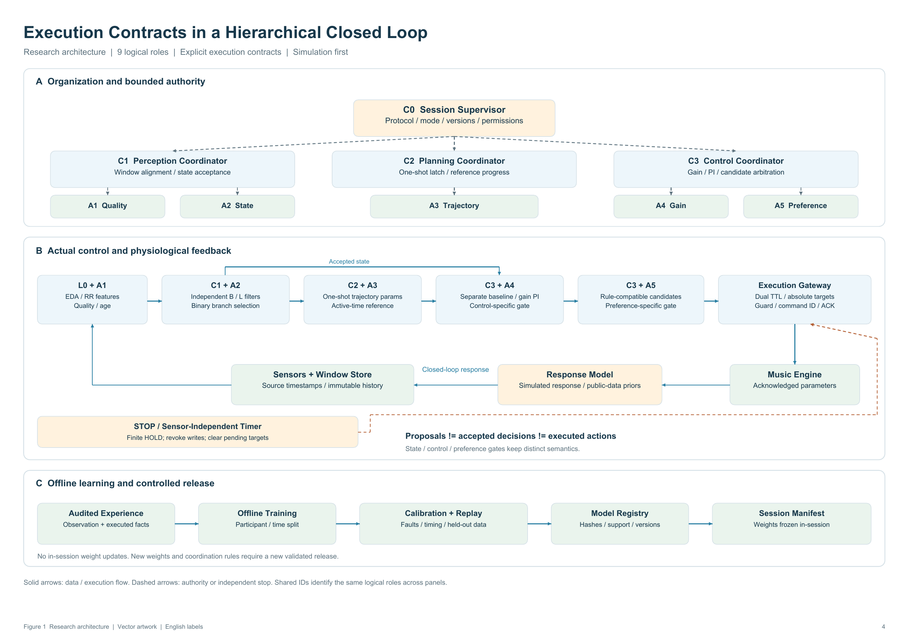

# v2.2 research and implementation

The current research question concerns **execution contracts for learning-enabled physiological-feedback music regulation**. The physiological closed loop and the C0/C1-C3/A1-A5 organization remain; additional hierarchy effects are exploratory. Public recordings and reactive simulation are the present evidence scope.



The diagram describes the research architecture. The implementation currently uses a single-process, synchronous simulation gateway; per-modality historical snapshots, real device ACKs and process-independent watchdogs remain integration work. A5 ranking is frozen to rules in the initial study. See [implemented behavior and limits](../V21_IMPLEMENTATION.md).

## Read the protocol

| Document | Editable text | Formatted PDF |
| --- | --- | --- |
| Full model, methods and publication route | [Chinese dossier](MODEL_V22.zh-CN.md) | [51-page dossier](pdf/MDT-v2.2-research-dossier.pdf) |
| Public-data selection and evidence experiments | [Chinese protocol](EXPERIMENTS_V22.zh-CN.md) | [21-page protocol](pdf/MDT-v2.2-data-evidence-protocol.pdf) |
| Reading, preprocessing, clocks and provenance | [Chinese SOP](PREPROCESSING_V22.zh-CN.md) | Included by reference in the protocol |
| Requirement mapping and next evidence gates | [Revision checklist](REVISION_V22.zh-CN.md) | See dossier chapters 19-21 |
| Strong baseline and independent review | [Implementation specification](BASELINE_SPEC.md) | Pending implementation/review |

The long dossier is a design archive, not a completed paper. Its manuscript budget is a writing plan, not an official venue page limit. Clinical sleep benefit, real-world failure prevalence and a new OPE theorem have not been established.

## Run the implemented workflow

Install from the repository root:

```sh
python -m pip install -e ".[dev]"
python examples/v21_contract_demo.py
python examples/v22_operator_ope_sanity.py
python -m mdt_core.evidence_cli examples/v22_audit_manifest.json
```

- The execution demo exercises absolute targets, dual TTLs, matching ACKs, command deduplication and finite HOLD/STOP with `NullEngine`.
- The exact OPE example reproduces known fixed-operator importance-sampling identities and a changed-clipping-boundary counterexample. It is not a novel estimator or empirical policy evaluation.
- The JSON audit accepts adjudicated event records, preserves unknown outcomes and keeps F1/F2/F3 provenance separate. The supplied example is constructed F3 data and must return `not_assessable` for M0. See [CLI schema and usage](../V22_AUDIT_CLI.md) and [statistical semantics](../V22_EVIDENCE_PROTOCOL.md).

None of these commands downloads participant data or constructs a real-world failure-rate estimate from software tests. Full CASE/WESAD adapters, trained artifacts, independent strong B1 and B0/B1/B2/H effect experiments remain uncompleted research tasks.

## Evidence gates

| Gate | Current status | Required before a stronger claim |
| --- | --- | --- |
| M0 / P0 natural failure prevalence | `not_assessable`; no qualifying natural execution logs found in the local audit | Provenance, event-specific risk sets, adjudicability, denominators and prespecified inference |
| F1 natural records | Unavailable | Complete natural trajectories or documented sampling probabilities |
| F2 external scenarios | Source-by-source review pending | Authoritative reference, version, operating conditions and whether frequency is known |
| F3 constructed tests | Software and mathematical checks available | Independent test scenarios and explicit constructed provenance; no prevalence claim |
| Strong B1 | Specification ready, independent implementation/review pending | Frozen capabilities and resource budget, implementer disclosure, external review |
| E_hier | Exploratory only | H-B2 comparisons with common contracts and independent endpoints |
| Operator-aware OPE paper | Conditional candidate | Increment beyond MIPS, OffCEM, mixed-measure OPE and smooth partial identification |
| Human efficacy paper | Future, separate study | Appropriate approval, prospective design, device validation and real outcomes |

For an event type, `eligible_session_ids` in the helper is already its **at-risk roster**. Keep broader cohort eligibility and not-at-risk counts outside that roster. Missing ACKs or missing records are unknown, not event-free. The assessable-subset rate is descriptive; it is not the whole-population risk. Exact risk bounds require complete adjudication and explicit independent/common-risk Bernoulli assumptions.

F1 requires actual **natural, uninjected** execution logs. Device runs with injected faults remain F3. Public physiology alone is not an MDT execution log. Source declarations, field validation and AI review do not authenticate evidence or complete independent baseline review.

## Publication tracks

1. **System paper:** execution contracts, strong comparison, provenance-specific failure evidence, coverage, control error and latency cost. Without M0/F1, constrain claims to mechanism and simulation.
2. **Future human study:** a separate prospective investigation of actual experience, physiology or sleep outcomes.
3. **Conditional ML paper:** changing execution operators and identification. Static marginalization, mixed-measure IS and generic no-overlap bounds are prior work. The prototype does not establish novelty.
